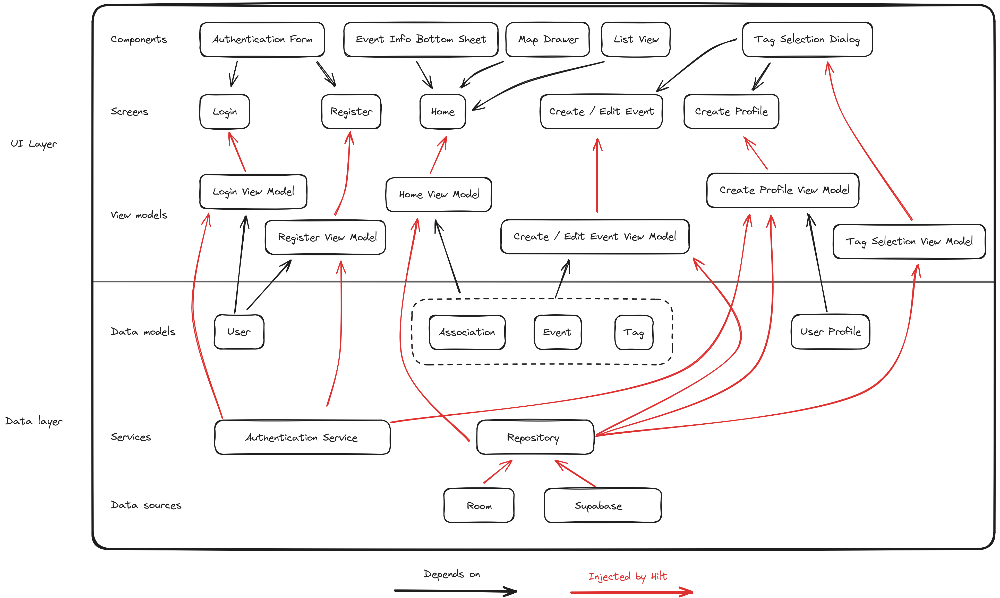

# Echo

## Installation

Go to [releases](https://github.com/echo-swent/echo/releases) and download the `app-debug.apk` asset from the latest release.

## Authentication

If you have trouble logging in, please use the following test credentials:

- test@example.com
- 123456

> [!NOTE]
> Make sure you are on the login page before entering the test credentials.

## Architecture

## Packages

### com.github.swent.echo.authentication

We use the `AuthenticationService` to sign in, sign up and sign out users. It's implemented using
Supabase and is defined as a singleton component which can be injected with Hilt.

### com.github.swent.echo.compose

This package contains the composables. Reusable components should be defined in the subpackage 
`components`. Screens shuold be defined in their own packages.

Note that the `navigation` package contains the `AppNavigationHost` composable which defines all the
screens and their navigation.

### com.github.swent.echo.connectivity

This package contains the `NetworkService` which is used to check the network connectivity. It's
used both in the UI and in the repository. In the UI it's used to disable button when there's no
network connection. In the repository it's used to decide whether to fetch data from the network or 
from the local database.

### com.github.swent.echo.data

This package contains the data models, the repositories and the data sources. The data models are
used to represent the data in the app. The repositories are used to fetch the data from the network
or from the local database when there's no network connection. The local data source is also used to
cache the data. In the subpackages `supabase` and `room` you can find the implementations of the
remote and local data source respectively.

### com.github.swent.echo.di

This package contains the Hilt modules. Those modules are used to provide the dependencies to the
components.

### com.github.swent.echo.viewmodels

This package contains the view models. If a feature has multiple view models, they should be defined
in their own subpackage.